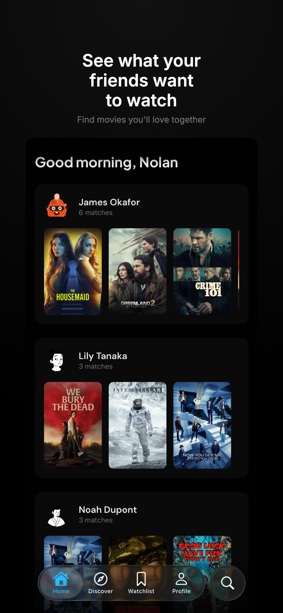
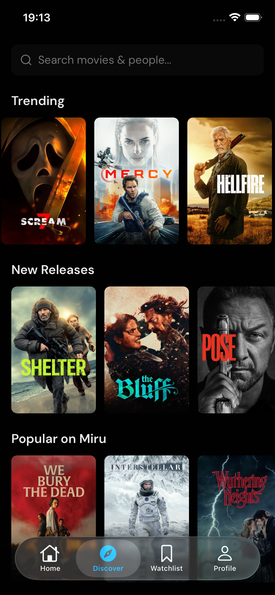
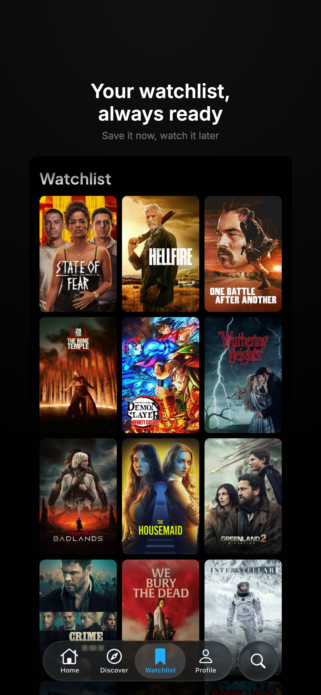
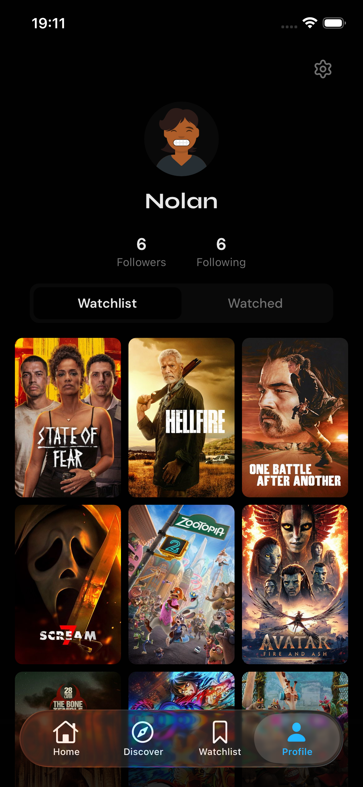

<p align="center">
  
</p>

<h1 align="center">Miru</h1>

<p align="center">
  Find movies to watch with friends.
  <br />
  <a href="https://watchmiru.app"><strong>watchmiru.app</strong></a>
</p>

<br />

<p align="center">
  
  &nbsp;&nbsp;
  
  &nbsp;&nbsp;
  
  &nbsp;&nbsp;
  
</p>

<br />

## What is Miru?

Miru matches your watchlist against your friends' lists so you never have to debate what to watch. Follow friends, build your watchlist, and instantly see which movies you both want to watch.

## Stack

| Layer    | Tech                                  |
| -------- | ------------------------------------- |
| Monorepo | Turborepo + pnpm                      |
| Web      | Next.js 16, React 19, Tailwind CSS v4 |
| Mobile   | React Native (Expo)                   |
| API      | tRPC v11                              |
| Database | Drizzle ORM + Neon Postgres           |
| Auth     | Better Auth                           |
| UI       | shadcn/ui                             |
| Data     | TMDB                                  |

## Project Structure

```
apps/
  web/         # Next.js web app
  mobile/      # React Native (Expo) mobile app
packages/
  db/          # Drizzle schema + Postgres client
  trpc/        # tRPC routers (shared API layer)
```

## Getting Started

```bash
pnpm install
docker compose up -d
cp apps/web/.env.example apps/web/.env
cp packages/db/.env.example packages/db/.env
pnpm db:migrate
pnpm db:seed
pnpm dev
```

Web app runs at `http://localhost:3000`.

## Scripts

| Command            | Description                          |
| ------------------ | ------------------------------------ |
| `pnpm dev`         | Start all dev servers                |
| `pnpm dev:web`     | Start web only                       |
| `pnpm dev:mobile`  | Start mobile only                    |
| `pnpm build`       | Build all packages                   |
| `pnpm lint`        | Run oxlint                           |
| `pnpm format`      | Run oxfmt                            |
| `pnpm typecheck`   | Type-check all packages              |
| `pnpm db:generate` | Generate Drizzle migrations          |
| `pnpm db:migrate`  | Apply Drizzle migrations             |
| `pnpm db:seed`     | Seed TMDB genres, providers & movies |
